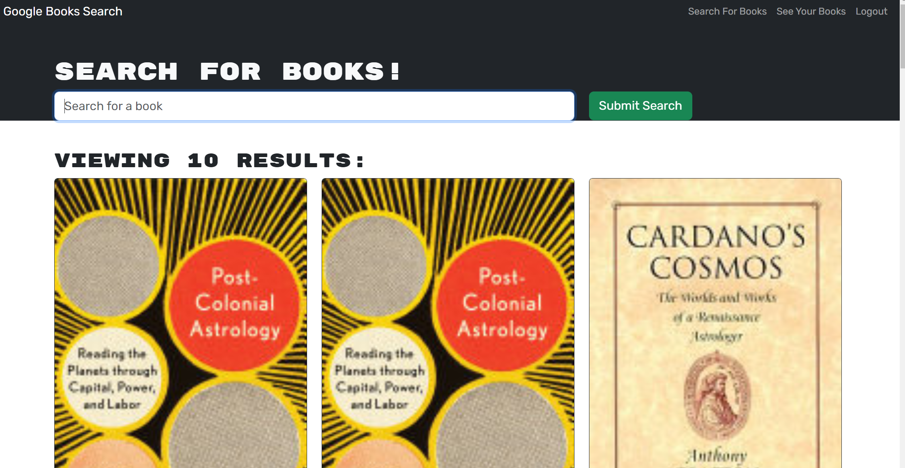

## Google Book Search Engine (Week #21 Challenge)

## Introduction
This project demonstrates the use of the MERN stack. Starter code used Restful API's which were reconfigured to use GraphQL. <a href="https://goldengayle.github.io/BookSearchEngine/">Link to Search Engine</a>

  

## How it was made
This project utilizes the MERN stack (Mongo DB, Express Server, React, Node).

## Optimizations
In the future,I would like to add more styling to this search engine. I would also add ratings to be rendered on the page as well. I would also like to deploy to heroku (for some reason my page doesn't render after being created)

## Lessons Learned
I learned alot about debugging through working through this challenges. When you are using a complex stack, the error messages aren't always as clear as I have grown accustommed to. I had to be very systematic about how to solve these issues and I even had to ask for help.

## Credits
All code was modified from class exercises by  @goldengayle.

## License
MIT License
Copyright (c) 2023 goldengayle
Permission is hereby granted, free of charge, to any person obtaining a copy of this software and associated documentation files (the "Software"), to deal in the Software without restriction, including without limitation the rights to use, copy, modify, merge, publish, distribute, sublicense, and/or sell copies of the Software, and to permit persons to whom the Software is furnished to do so, subject to the following conditions:
The above copyright notice and this permission
